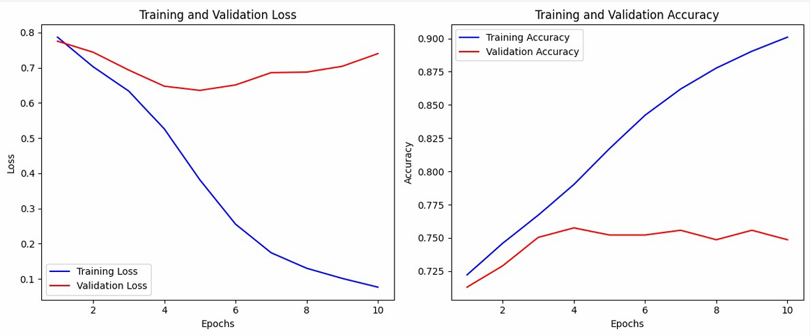
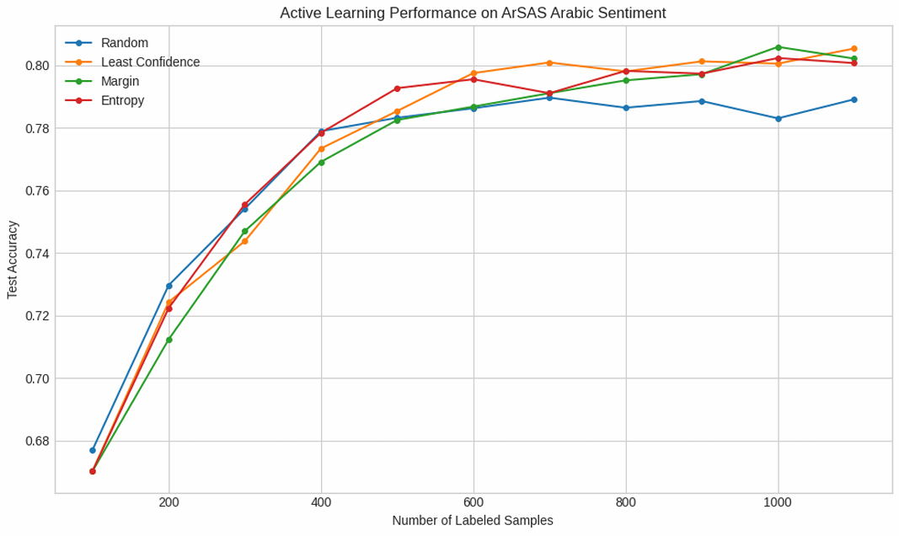
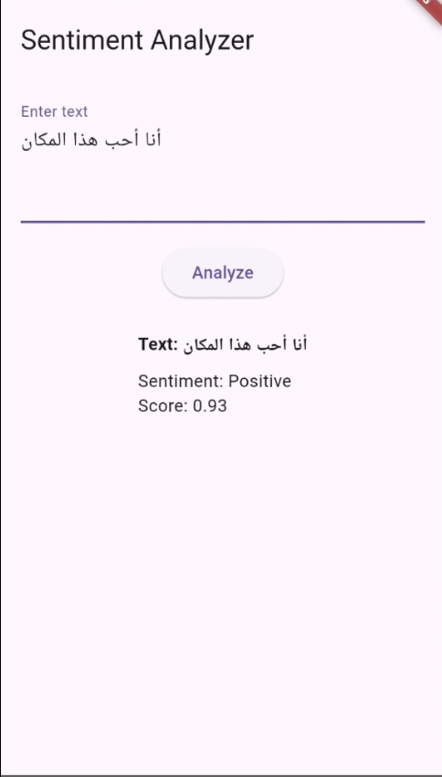

# Active Learning Solution for Overfitting Model
## Problem: Overfitting
The original model was overfitting, as shown below:


This resulted in the following performance:
* Training set accuracy ~ 95%
* Test set accuracy ~ 74%

## How did we solve the problem?
We addressed the overfitting problem by applying active learning techniques. The improved model's performance is shown below:


The model's performance after applying active learning:
* Training set accuracy ~ 83%
* Test set accuracy ~ 80%

## To run the Mobile App
To run the mobile app:
1. Create a virtual environment and activate it.
  ```
  python -m venv venv
  source venv/bin/activate  # On Linux/macOS
  venv\Scripts\activate.bat # On Windows
  ```

2. Install the required dependencies.
  `pip install -r requirements.txt`

3. Install the model `https://www.kaggle.com/models/omarkouta/arabicsentimentclf` to `backend/venv/models/checkpoint-90`

4. Run the backend server.
  `python app.py`

5. Run the Flutter app on a device or emulator.
  `flutter run`

